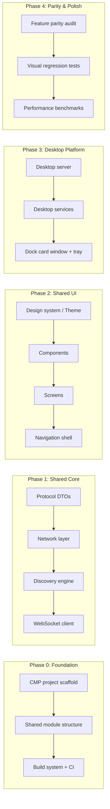

# DeX → Compose Multiplatform Migration Plan (DESKTOP ONLY)

> # ⚠️ NON-NEGOTIABLE MIGRATION RULES — READ BEFORE ANY WORK ⚠️
>
> ## SCOPE: DESKTOP ONLY — WINDOWS AND macOS
> 1. **DESKTOP ONLY.** The legacy **WPF / C# / PowerShell** desktop implementation is being migrated to **Kotlin + Compose Multiplatform**. The Compose/Kotlin Multiplatform codebase is the desktop application for **Windows AND macOS** — both platforms run the **SAME shared Kotlin code**. That is the ONLY target.
> 2. **The Android app (`DeX/DeX/app`) is NOT part of this migration.** Never modify, refactor, rewire, or migrate it. It stays exactly as it is — it lives ONLY at `W:\CodeDeX\DeX\DeX` and never moves during archiving.
> 3. **No Android target may be added to the Compose desktop app** (`composeApp` is desktop-only: `desktopMain` + `commonMain`, no `androidMain`, no `androidTarget()`).
>
> ## HARD RULES — ZERO TOLERANCE, NO EXCEPTIONS
> 1. **NEVER delete, remove, archive, rename, or move ANY WPF / C# / PowerShell / legacy file** — not one file, not one line, not one asset — **for ANY reason**.
> 2. **NEVER** "tidy up", "fix", or "improve" legacy WPF/C#/PowerShell code on your own initiative.
> 3. **Only the USER may decide** when the legacy WPF/C#/PowerShell is archived. Until the user says so, it is untouchable.
> 4. **The ONLY archive procedure** (executed only when the user orders it): move the Compose/Kotlin Multiplatform code **UP one directory — from `W:\CodeDeX\DeX\DeX` to `W:\CodeDeX\DeX`**. The Android app stays at `W:\CodeDeX\DeX\DeX`. Nothing else is archived, removed, or restructured.
> 5. **If in doubt — STOP and ASK. Do not act.**
>
> **REPEAT: DESKTOP ONLY. Windows + macOS. ONE Kotlin/Compose Multiplatform codebase. Legacy WPF/C#/PowerShell stays untouched until the user says otherwise. Android stays at `W:\CodeDeX\DeX\DeX`.**

## Goal

Migrate the legacy **WPF / C# / PowerShell** desktop implementation into a **single Kotlin + Compose Multiplatform (CMP) desktop application for Windows AND macOS** — both platforms run the SAME shared Kotlin code (`composeApp` + `core/*` + `feature/*`):

1. **UI parity** — 1:1 floating docked card UI matching the legacy WPF app (authoritative UI spec: [`UltimateMigrationPlan-WPF-Compose-UI.md`](UltimateMigrationPlan-WPF-Compose-UI.md))
2. **Zero feature regression** — every WPF/C#/PowerShell feature survives
3. **macOS deployment** — native `.dmg` distribution with system tray/menu bar and notarization
4. **Maintainability** — one Kotlin codebase replacing C#, PowerShell, and XAML

**The Android app is OUT OF SCOPE.** It stays untouched at `W:\CodeDeX\DeX\DeX`. It is used ONLY as a wire-compatibility test client against the desktop server — never modified, migrated, or merged.

---
## Migration Status (2026-08)

| Phase | Scope | Status |
|---|---|---|
| **0** | Scaffold — `composeApp` + `core/*` + `feature/*` modules, Gradle build, CI | ✅ DONE |
| **1** | Shared Core — protocol, network, data layers ported from the C# engine | ✅ DONE |
| **2** | Shared UI — design system + discovery/history/settings screens | ✅ DONE |
| **3** | Platform Integration — desktop server, dock card window, mirror/transfer, tray | ✅ DONE (M1–M4; 58 desktop tests green) |
| **4** | Parity & Polish — feature audit, macOS packaging, real-device verification | ⏳ OPEN |
| **5** | Deferred enhancements | ⏳ OPEN |

Each phase produces a **shippable checkpoint** verified against the existing apps before proceeding.

---
## Design Decisions

Based on our discussion, the following architectural choices have been made:

1. **Window Resize Strategy**: **Fixed Large Canvas (Option A)**. We will use a fixed large transparent canvas (1420x760) and animate the visible UI inside it. This matches WPF behavior precisely and avoids AWT window resize flicker.
2. **Deactivation Behavior**: **Auto-hide with Pin (Option A)**. We will auto-hide the card on focus loss, but provide a "Pin" toggle (which already exists in the UI design) to keep it visible.
3. **Cross-Platform Docking**: **Adaptive Docking (Option A)**. On Windows, the card will dock to the bottom-right (above the taskbar). On macOS, the card will drop down from the top-right (menu bar), attached to the tray icon.

---
## Current Architecture Inventory

### What We're Replacing (legacy — stays in place, untouchable until the user archives it)

#### Windows Desktop (WPF/.NET 10 + PowerShell) — `DeXShareTarget/` + `MSIX_Source/`
| Layer | Files | Technology |
|---|---|---|
| **Entry Point & Server** | `Program.cs`, `LocalSendServer.cs` | .NET 10 Kestrel (HTTP/1.1 + HTTP/3 QUIC + WebSocket) |
| **REST Endpoints** | 7 files in `Endpoints/` | ASP.NET Minimal APIs |
| **Services** | 16 files in `Services/` | C# background services (Discovery, QUIC P2P, Identity, Mirror, Clipboard, OAuth, UPnP, Wallpaper) |
| **WPF UI** | `TransferWindow.cs`, `MirrorWindow.cs`, `MainWindow.xaml` + themes | WPF + WinForms system tray |
| **PowerShell Engine** | `Connect-Engine.ps1` + 16 modules | PS 5.1 orchestration, XAML bindings, UI logic |
| **Packaging** | `PackMSIX.ps1`, `SignMSIX.ps1`, `AppxManifest.xml` | MSIX + `.appinstaller` |
| **Tests** | 17 C# test classes + Pester + FlaUI UI tests + Chaos debugger | MSTest + Pester + FlaUI |

---
## Migration Strategy: The Strangler Fig Pattern

Rather than a risky "big bang" rewrite, we use the **Strangler Fig** approach:

The WPF app remains fully functional and installable during the entire transition — it is the reference implementation.

---
## Anti-Regression Strategy

### 1. Feature Registry (The Regression Firewall)
An exhaustive checklist of every capability of the **WPF desktop app**. Each feature gets:
- A unique ID
- Platform origin (Windows / macOS)
- Migration status (Not Started → In Progress → Migrated → Verified)
- Verification method (Unit test / Integration test / Manual / Screenshot comparison)

### 2. Screenshot Comparison Pipeline
Compose Preview Screenshot Testing captures golden screenshots of desktop composables; the legacy WPF UI screenshots are the reference. Any delta > 2% triggers review.

### 3. Protocol Compatibility Testing
The desktop app communicates with the Android app over WebSocket + HTTP. During migration, we run both the **old WPF server** and the **new CMP desktop server** against the **same existing Android client** to verify wire-protocol parity (live A/B test). The Android app is used as a test client only — it is NOT modified.

### 4. Incremental Canary Releases
Each phase produces a tagged release. The old WPF app remains installable alongside the new CMP desktop app during the transition.

---
## Proposed Changes

### Phase 0: Project Scaffold & Build System — ✅ DONE

#### The Directory Structure (current, after the archive step)
```
W:\CodeDeX\DeX\                                # Repo root = DESKTOP Compose project
├── composeApp/                                # Desktop entry point (desktopMain + commonMain ONLY)
│   └── src/desktopMain/                       # main.kt, window management, dock card
├── core/                                      # network/, data/, designsystem/
├── feature/                                   # discovery/, settings/, history/
├── gradle/  gradlew  settings.gradle.kts      # Desktop Gradle build (NO :app module)
├── DeX/                                       # Android-ONLY standalone project (app/) — untouched
├── DeXShareTarget/                            # LEGACY WPF/C# — DO NOT TOUCH (per rules)
├── MSIX_Source/                               # LEGACY MSIX packaging — DO NOT TOUCH (per rules)
└── AGENTS.md  README.md  PROJECT.md           # Rules + docs
```

- `composeApp` targets **`jvm("desktop")` ONLY** — no `androidTarget()`, no `androidMain` (per rules).
- The Android app lives in `DeX/` with its own standalone Gradle build — never referenced from the desktop build.
- No `:app` module exists in the desktop project.

### Phase 1: Shared Core — Network & Data Layer — ✅ DONE
The network layer is the foundation. The desktop client and server share the same protocol as the C# engine. Wire format must be **byte-identical** to the existing C# implementation for protocol compatibility.

Implemented in `core/data` + `core/network` (`commonMain` + `jvmMain`/`desktopMain`):
- Protocol DTOs (`ProtocolDto`, `DeXPorts`, `TransferState`, `PunchState`, `Signaling`, `TokenCodec`, `HashUtils`, …)
- Network client layer (Ktor), Discovery engine (UDP + mDNS via jmDNS on JVM), WebSocket engine
- Data layer (DeviceConfig, PcMemory, TransferHistory, WallpaperState)
- `jvmMain` implementations: `DesktopJmDnsService`, `DesktopUdpService`, `JvmMirrorEngine`, `JvmHardwareTelemetry`, `DesktopPlatformEngine`

### Phase 2: Shared UI — Design System & Screens — ✅ DONE
`core/designsystem` + `feature/*` (`commonMain` + `jvmMain`/`desktopMain`):
- Design system: Color/Type/Shape/Theme tokens, Liquid Glass components, MaterialSymbols, DeXButtons/DeXPanel/DeXScrollbar/FilePicker/HoverState
- Screens: discovery (MainScreen grid/compact), history, settings — with `desktopMain`/`jvmMain` platform helpers
- `commonMain` only — no `androidMain` in any desktop module (per rules).

### Phase 3: Desktop Platform Integration — ✅ DONE (M1–M4)

#### 3.1 Desktop Server — `desktopMain` / `core/network` `jvmMain`
- Embedded **Ktor Server** (Netty engine), HTTP/1.1 port 48424, WebSocket `/ws`, TLS certificate management
- **Ported FROM C# (legacy stays untouched):**
  - `LocalSendEndpoints.*.cs` → `routes/*.kt` (`ControlRoutes`, `DeviceRoutes`, `FileExplorerRoutes`, `ShareRoutes`, `WebSocketRoutes`)
  - `DiscoveryBackgroundService.cs` → jmDNS + UDP discovery services
  - `IdentityManager.cs`, `ClipboardService.cs` (AWT clipboard), `WallpaperService.cs`, `UpnpPortForward.cs`, `GoogleOAuth.cs`, `RelayService.cs` → Kotlin equivalents

#### 3.2 Desktop Window Management — `desktopMain/window/`
> [!WARNING]
> **DEPRECATED APPROACH (DeX Workstation Full Window)**
> The original plan proposed a standard decorated desktop window with a title bar and full-screen `App()` composable. This approach has been completely deprecated because it violates the 1:1 visual and UX parity requirements of the legacy WPF floating card.
>
> The desktop UI exclusively uses the exact WPF floating card replica in Compose.
>
> **For the complete, authoritative 1:1 UI parity blueprint, you MUST follow:**
> 👉 **[UltimateMigrationPlan-WPF-Compose-UI.md](UltimateMigrationPlan-WPF-Compose-UI.md)**

Implemented (M1–M4): `DockedWindowStateController`, `FloatingDockCard`, dock card kinematics/physics, QuickActionBar, device lists, file explorer, settings panel, PIN/QR pairing, liquid glass styling, tray + AWT UTILITY window.

#### 3.3 Desktop Services (per rules, desktop-only)
- `DesktopClipboardService`, `DesktopUpnpService`, `FileExplorerService`, `WebSocketConnectionManager`, `DesktopShutdownCoordinator`

> ⚠️ **There is NO Android platform layer in this plan.** Android services (DexService, Workers, SAF, ShareTarget, …) live ONLY in the standalone Android project at `DeX/DeX` and are NEVER migrated into the desktop codebase.

### Phase 4: Parity Audit & Polish — ⏳ OPEN

#### 4.1 Feature Registry Audit
- Walk through every item in `feature_registry.md`
- Mark each feature ✅ Verified or ❌ Regression; fix all regressions first

#### 4.2 Desktop-Specific Enhancements
- Keyboard shortcuts (`Cmd/Ctrl+V` paste files, `Cmd+,` settings, `Cmd+Q` quit)
- Drag-and-drop onto window triggers transfer
- Native file dialogs (AWT `FileDialog`)
- Desktop scrollbars, hover states
- macOS title bar: integrated transparent title bar with traffic lights

#### 4.3 macOS Packaging
- Configure `nativeDistributions` for `.dmg` output
- macOS app icon (`.icns`), Apple Developer ID code signing, notarization
- Test on Apple Silicon and Intel Macs

#### 4.4 CI/CD (desktop-only)
- `.github/workflows/release-desktop.yml`: build `.dmg` (macOS) + `.msi` (Windows), publish release artifacts
- Desktop validation: `desktopTest`, `desktopJar`, `createDistributable`
- The Android app has its own standalone build in `DeX/` — no Android tasks run in the desktop CI

#### 4.5 Legacy Sunset — **NOT PART OF THIS PLAN**
Per the rules, the legacy WPF/C#/PowerShell is **NEVER removed, deleted, or archived by this migration**. It stays exactly where it is until the **user** orders the archive. The ONLY archive procedure is defined in `AGENTS.md` (move the Compose/Kotlin Multiplatform code up one directory to `W:\CodeDeX\DeX`; nothing else moves).

### Phase 5: Deferred Enhancements (Post-Migration)
Deferred intentionally to avoid scope creep:
1. **QUIC/HTTP3 on Desktop** — Jetty HTTP3 via Ktor engine (currently HTTP/2 + TCP fallback)
2. **v3 Trust Architecture** — SPAKE2+, mTLS, Hardware Keystores (per `DeX_v3_Architecture.md`)
3. **Navigation 3 migration** — official type-safe navigation
4. **Room database** — structured TransferHistory queries
5. **Compose Hot Reload** — rapid UI iteration

> 🚫 **OUT OF SCOPE (per rules): iOS target, Web/Wasm target, Android targets — DESKTOP ONLY. Windows + macOS.**

---
## Verification Plan

### Automated Tests
```bash
# Desktop unit/kinematic/styling suites (all green: 58 tests)
./gradlew :composeApp:desktopTest

# Desktop packaging
./gradlew :composeApp:desktopJar
./gradlew :composeApp:createDistributable
./gradlew :composeApp:packageDmg      # macOS
./gradlew :composeApp:packageMsi      # Windows
```

### Manual Verification
- **Protocol A/B**: CMP desktop server ↔ old WPF server, both against the same existing Android client — verify identical behavior (Android used as test client only)
- **Windows smoke test**: run CMP desktop on Windows, verify feature parity with the old WPF app
- **macOS smoke test**: install `.dmg`, pair with Android, transfer files, verify mirror

### Regression Gates
- No phase advances until its verification checkpoint passes 100%
- Feature registry must show zero ❌ items
- Legacy WPF/C#/PowerShell remains byte-for-byte untouched

---
## Risk Assessment

| Risk | Impact | Mitigation |
|---|---|---|
| Liquid Glass visual drift on Desktop | Medium | Screenshot comparison tests; dedicated glass tuning sprint |
| Ktor Server doesn't match Kestrel wire format | High | Protocol compatibility integration tests; byte-level response comparison |
| QUIC unavailable on JVM Desktop | Medium | Defer to Phase 5; HTTP/2 + TCP fallback is proven and fast on LAN |
| macOS sandbox blocks ADB | High | Use Developer ID distribution (not Mac App Store); consider `adblib` |
| Desktop startup latency (JVM cold start) | Low | JVM AppCDS, stripped JRE via `jlink`, pre-compiled layouts |
| Glass performance on low-end desktop GPUs | Low | Graceful degradation: disable blur, fall back to solid translucent panel |

---
## Estimated Timeline

| Phase | Duration | Deliverable |
|---|---|---|
| **Phase 0**: Scaffold | ✅ done | Desktop-only CMP project builds |
| **Phase 1**: Shared Core | ✅ done | Network + data layer; protocol tests pass |
| **Phase 2**: Shared UI | ✅ done | All screens render on desktop; screenshot tests pass |
| **Phase 3**: Platform Integration | ✅ done | Desktop server runs; dock card UI complete; Windows ↔ Android connectivity works |
| **Phase 4**: Parity & Polish | 2–3 weeks | Feature registry 100%; macOS DMG built and notarized |
| **Total** | Phases 0–3 complete | Remaining: Phase 4 (macOS + parity) |

---
## Decisions Log

**Q1: Windows-first.** CMP's `jvm("desktop")` runs on Windows, macOS, and Linux, but we only have a Windows machine — build and test natively on Windows until parity with the WPF app, then cross-compile for macOS later when a Mac is available. ✅ (adopted)

**Q2: Navigation Strategy.** Use official CMP Navigation (`navigation-compose`) for the desktop app's internal flows. ✅ (adopted)

**Q3: Screen Mirroring Scope.** Viewer-only: the desktop app receives frames from the Android device and renders them (matches current WPF behavior). ✅ (adopted)

**Q4: QUIC/HTTP3 on Desktop.** Fallback to HTTP/2 + TCP for Phase 1 — much simpler, fast on LAN; upgrade to QUIC later. ✅ (adopted)

**Q5: Test Porting Approach.** Port critical-path tests only (networking, parsing, state logic) alongside each feature phase, rather than bulk-translating the 17 C# test classes. ✅ (adopted)

---
## ULTIMATE RULE (scoped to the DESKTOP Kotlin/Compose codebase ONLY)

ALL LOGICS/FUNCTIONS/ENGINES/COMPONENTS (that can exist on their own) within the **desktop Kotlin/Compose Multiplatform codebase** (`composeApp`, `core/*`, `feature/*`) MUST be refactored, modularized, and centralized. NOTHING MUST BE HARD CODED. NEVER BREAK EXISTING FUNCTIONALITY — INSTEAD OPTIMIZE IT. All dependencies MUST be at their absolute latest stable versions.

> ⚠️ This rule applies **EXCLUSIVELY to the desktop KMP code**. It NEVER applies to the legacy WPF/C#/PowerShell code (untouchable per the rules above) and NEVER to the Android app (`DeX/DeX`).
