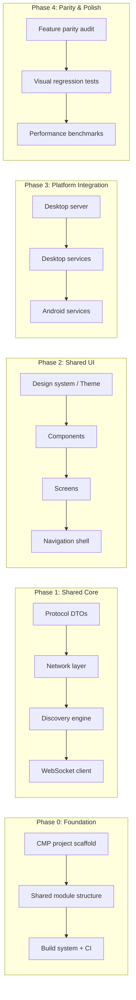

# DeX → Compose Multiplatform Migration Plan

> # ⚠️ NON-NEGOTIABLE MIGRATION RULES — READ BEFORE ANY WORK ⚠️
>
> ## SCOPE: DESKTOP ONLY — WINDOWS AND macOS
> 1. **DESKTOP ONLY.** The legacy **WPF / C# / PowerShell** desktop implementation is being migrated to **Kotlin + Compose Multiplatform**. The Compose/Kotlin Multiplatform codebase is the desktop application for **Windows AND macOS** — both platforms run the **SAME shared Kotlin code**. That is the ONLY target.
> 2. **The Android app (`DeX/app`) is NOT part of this migration.** Never modify, refactor, rewire, or migrate it. It stays exactly as it is — it lives ONLY at `W:\CodeDeX\DeX\DeX` and never moves during archiving.
> 3. **No Android target may be added to the Compose desktop app** (`composeApp` is desktop-only: `desktopMain` + `commonMain`, no `androidMain`, no `androidTarget()`).
>
> ## HARD RULES — ZERO TOLERANCE, NO EXCEPTIONS
> 1. **NEVER delete, remove, archive, rename, or move ANY WPF / C# / PowerShell / legacy file** — not one file, not one line, not one asset — **for ANY reason**.
> 2. **NEVER** "tidy up", "fix", or "improve" legacy WPF/C#/PowerShell code on your own initiative.
> 3. **Only the USER may decide** when the legacy WPF/C#/PowerShell is archived. Until the user says so, it is untouchable.
> 4. **The ONLY archive procedure** (executed only when the user orders it): move the Compose/Kotlin Multiplatform code **UP one directory — from `W:\CodeDeX\DeX\DeX` to `W:\CodeDeX\DeX`**. The Android app stays at `W:\CodeDeX\DeX\DeX`. Nothing else is archived, removed, or restructured.
> 5. **If in doubt — STOP and ASK. Do not act.**
>
> **REPEAT: DESKTOP ONLY. Windows + macOS. ONE Kotlin/Compose Multiplatform codebase. Legacy WPF/C#/PowerShell stays untouched until the user says otherwise. Android stays at `W:\CodeDeX\DeX\DeX`.**

## Goal
Migrate the DeX project from its current **dual-stack architecture** (WPF/.NET 10 + PowerShell desktop app ↔ Android Jetpack Compose app) into a **unified Compose Multiplatform (CMP)** codebase targeting **Android + macOS Desktop** (with Windows Desktop as a bonus), achieving:
1. **UI parity** — One shared Compose UI across all platforms
2. **Zero feature regression** — Every feature from both the WPF and Android apps must survive
3. **macOS deployment** — Native `.dmg` distribution with system tray, menu bar, and notarization
4. **Maintainability** — Single Kotlin codebase replacing C#, PowerShell, and XAML
---
## Design Decisions

Based on our discussion, the following architectural choices have been made:

1. **Window Resize Strategy**: **Fixed Large Canvas (Option A)**. We will use a fixed large transparent canvas (1420x760) and animate the visible UI inside it. This matches WPF behavior precisely and avoids AWT window resize flicker.
2. **Deactivation Behavior**: **Auto-hide with Pin (Option A)**. We will auto-hide the card on focus loss, but provide a "Pin" toggle (which already exists in the UI design) to keep it visible.
3. **Cross-Platform Docking**: **Adaptive Docking (Option A)**. On Windows, the card will dock to the bottom-right (above the taskbar). On macOS, the card will drop down from the top-right (menu bar), attached to the tray icon.
---
## Current Architecture Inventory
### What We're Replacing
#### Windows Desktop (WPF/.NET 10 + PowerShell) — `DeXShareTarget/` + `MSIX_Source/`
| Layer | Files | Technology |
|---|---|---|
| **Entry Point & Server** | `Program.cs`, `LocalSendServer.cs` | .NET 10 Kestrel (HTTP/1.1 + HTTP/3 QUIC + WebSocket) |
| **REST Endpoints** | 7 files in `Endpoints/` | ASP.NET Minimal APIs |
| **Services** | 16 files in `Services/` | C# background services (Discovery, QUIC P2P, Identity, Mirror, Clipboard, OAuth, UPnP, Wallpaper) |
| **WPF UI** | `TransferWindow.cs`, `MirrorWindow.cs`, `MainWindow.xaml` + themes | WPF + WinForms system tray |
| **PowerShell Engine** | `Connect-Engine.ps1` + 16 modules | PS 5.1 orchestration, XAML bindings, UI logic |
| **Packaging** | `PackMSIX.ps1`, `SignMSIX.ps1`, `AppxManifest.xml` | MSIX + `.appinstaller` |
| **Tests** | 17 C# test classes + Pester + FlaUI UI tests + Chaos debugger | MSTest + Pester + FlaUI |
#### Android (Jetpack Compose) — `DeX/app/`
| Layer | Files | Technology |
|---|---|---|
| **UI Screens** | `MainScreen`, `HistoryScreen`, `SettingsScreen` + 20+ composables | Jetpack Compose + Material 3 + Liquid Glass (`backdrop`) |
| **Navigation** | `Navigation.kt` | Custom `AnimatedContent` tab switcher (not using Navigation component) |
| **ViewModel** | `MainScreenViewModel.kt` | MVVM with `StateFlow` |
| **Network** | 37 files in `network/` | Ktor 3.5.2, OkHttp 5.4 WebSockets, Cronet QUIC |
| **DI** | `AppModule.kt` | Koin 4.2.2 |
| **Theme** | `Theme.kt`, `Color.kt`, `Type.kt`, `Shape.kt`, `Animations.kt` | Material 3 dynamic color + Liquid Glass |
| **Platform** | `DexService`, `ClipboardSyncTileService`, `ShareTargetActivity`, `AppFunctions` | Android Foreground Services, WorkManager, SAF, MediaProjection |
---
--
## Migration Strategy: The Strangler Fig Pattern
Rather than a risky "big bang" rewrite, we use the **Strangler Fig** approach:

Each phase produces a **shippable checkpoint** that can be verified against the existing apps before proceeding.
---
Each phase produces a **shippable checkpoint** that can be verified against the existing apps before proceeding.
---
## Anti-Regression Strategy
### 1. Feature Registry (The Regression Firewall)
Before writing a single line of CMP code, we create a **feature registry** — an exhaustive checklist of every capability from both apps. Each feature gets:
- A unique ID
- Platform origin (Android / Windows / Both)
- Migration status (Not Started → In Progress → Migrated → Verified)
- Verification method (Unit test / Integration test / Manual / Screenshot comparison)
### 2. Screenshot Comparison Pipeline
For UI regression, we use **Compose Preview Screenshot Testing** (`compose-screenshot-testing-plugin`) to capture golden screenshots of every composable on Android, then compare against desktop renders. Any delta > 2% pixel difference triggers a review.
### 3. Protocol Compatibility Testing
The Android app and desktop app communicate over WebSocket + HTTP. During migration, we run both the **old WPF server** and the **new CMP desktop server** against the same Android client to verify wire-protocol parity. This is a live A/B test.
### 4. Incremental Canary Releases
Each phase produces a tagged release. The old WPF app remains installable alongside the new CMP desktop app during the transition. Users can switch back if regressions are found.
---
## Proposed Changes
### Phase 0: Project Scaffold & Build System
#### The New Directory Structure

```
DeX/                                    # Repository root (unchanged)
├── DeX/                                # ← The CMP multiplatform project
│   ├── build.gradle.kts                # Root build (KMP + AGP + Compose plugins)
│   ├── settings.gradle.kts             # Includes all core/ and feature/ modules
│   ├── gradle/
│   │   └── libs.versions.toml          # Unified version catalog
│   ├── core/                           # ★ NEW: Foundational modular layers
│   │   ├── network/                    # Ktor client, Desktop Server, Discovery
│   │   ├── data/                       # DataStore, TransferHistory, Repositories
│   │   └── designsystem/               # Shared theme, Glass effects, Colors
│   ├── feature/                        # ★ NEW: Modularized UI screens
│   │   ├── discovery/                  # MainScreen, pairing logic
│   │   ├── settings/                   # Settings screen
│   │   └── history/                    # Transfer history screen
│   ├── composeApp/                     # ★ NEW: The desktop entry point
│   │   └── src/desktopMain/            # Desktop `main.kt` and window management
│   └── app/                            # ★ LEGACY/SHELL: Android entry point
│
├── DeXShareTarget/                     # ★ LEGACY: Old C# desktop app
│   └── (kept for protocol compatibility testing, removed after Phase 4)
│
├── MSIX_Source/                         # ★ LEGACY: Old MSIX packaging
│   └── (kept for reference, removed after Phase 4)
│
├── feature_registry.md                  # ★ NEW: Regression firewall checklist
├── CHANGELOG.md
└── README.md
---
#### [MODIFY] [settings.gradle.kts](file:///w:/CodeDeX/DeX/DeX/settings.gradle.kts)
- Add `include(":composeApp")` alongside existing `include(":app")`
- Add JetBrains Compose plugin repository
- Both modules coexist during migration; `:app` is deprecated after Phase 4
#### [MODIFY] [build.gradle.kts](file:///w:/CodeDeX/DeX/DeX/build.gradle.kts)
- Add CMP plugins: `org.jetbrains.kotlin.multiplatform`, `org.jetbrains.compose`, `org.jetbrains.kotlin.plugin.compose`
- Keep existing Android plugins for the legacy `:app` module
#### [MODIFY] [libs.versions.toml](file:///w:/CodeDeX/DeX/DeX/gradle/libs.versions.toml)
- Add CMP versions: `compose-multiplatform = "1.10.0"` (or latest stable)
- Add multiplatform Jetpack artifacts: `org.jetbrains.androidx.lifecycle:lifecycle-viewmodel-compose`, `org.jetbrains.androidx.navigation:navigation-compose`
- Add Koin multiplatform: `koin-compose`, `koin-compose-viewmodel`
- Add Ktor Server: `ktor-server-core`, `ktor-server-netty`, `ktor-server-websockets`, `ktor-server-content-negotiation`
- Add multiplatform DataStore: `androidx.datastore:datastore-preferences` (1.1+ is KMP)
- Add `kotlinx-io-core` for multiplatform file I/O
#### [NEW] `composeApp/build.gradle.kts`
- KMP module with `androidTarget()` + `jvm("desktop")`
- Source sets: `commonMain`, `androidMain`, `desktopMain`, `commonTest`, `androidTest`, `desktopTest`
- Desktop packaging config with `compose.desktop.application.nativeDistributions` (DMG, MSI targets)
- macOS signing and notarization configuration
#### [NEW] `feature_registry.md`
- Exhaustive feature checklist (see Anti-Regression Strategy section)
---
### Phase 1: Shared Core — Network & Data Layer (~2-3 weeks)
The network layer is the foundation. Both the Android client and the desktop server/client share the same protocol. By making this multiplatform first, we can verify wire compatibility.
#### 1.1 Protocol DTOs → `commonMain/kotlin/.../network/protocol/`
##### [MIGRATE] [ProtocolDto.kt](file:///w:/CodeDeX/DeX/DeX/app/src/main/java/com/dexstudios/dex/network/ProtocolDto.kt) → `commonMain`
- Already `@Serializable` Kotlin data classes — moves as-is
- Zero changes needed, just relocate to shared source set

#### [MIGRATE] [DeXPorts.kt](file:///w:/CodeDeX/DeX/DeX/app/src/main/java/com/dexstudios/dex/network/DeXPorts.kt) → `commonMain`
- Port constants — trivial move
##### [MIGRATE] [TransferState.kt](file:///w:/CodeDeX/DeX/DeX/app/src/main/java/com/dexstudios/dex/network/TransferState.kt) → `commonMain`
- State machine — pure Kotlin, moves as-is
##### [MIGRATE] [PunchState.kt](file:///w:/CodeDeX/DeX/DeX/app/src/main/java/com/dexstudios/dex/network/PunchState.kt) → `commonMain`
- NAT punch state — pure Kotlin
##### [MIGRATE] [HashUtils.kt](file:///w:/CodeDeX/DeX/DeX/app/src/main/java/com/dexstudios/dex/network/HashUtils.kt) → `commonMain`
- SHA256 hashing — uses `java.security.MessageDigest` which is available on JVM (both Android and Desktop)
- If any Android-specific API is used, abstract behind `expect`/`actual`
##### [MIGRATE] [TokenCodec.kt](file:///w:/CodeDeX/DeX/DeX/app/src/main/java/com/dexstudios/dex/network/TokenCodec.kt) → `commonMain`
---
#### 1.2 Network Client Layer → `commonMain/kotlin/.../network/`
##### [MIGRATE] [ClientEngine.kt](file:///w:/CodeDeX/DeX/DeX/app/src/main/java/com/dexstudios/dex/network/ClientEngine.kt) → `commonMain`
- Ktor HTTP client logic — already uses `ktor-client-core` which is multiplatform
- Engine selection becomes `expect`/`actual`: Android → OkHttp engine, Desktop → CIO engine
##### [MIGRATE] [MessageHandler.kt](file:///w:/CodeDeX/DeX/DeX/app/src/main/java/com/dexstudios/dex/network/MessageHandler.kt) → `commonMain`
- WebSocket message routing — pure Kotlin logic
##### [MIGRATE] [WebSocketClientService.kt](file:///w:/CodeDeX/DeX/DeX/app/src/main/java/com/dexstudios/dex/network/WebSocketClientService.kt) → `commonMain` (with `expect`/`actual` for lifecycle)
- The WebSocket connection logic is platform-agnostic (Ktor/OkHttp)
- Lifecycle management differs: Android uses `Service` binding, Desktop uses coroutine scope tied to app lifecycle
- Extract core logic to `commonMain`, platform lifecycle hooks to `expect`/`actual`
##### [MIGRATE] [DiscoveryEngine.kt](file:///w:/CodeDeX/DeX/DeX/app/src/main/java/com/dexstudios/dex/network/DiscoveryEngine.kt) → Split
- UDP Multicast logic → `commonMain` (uses `java.net.MulticastSocket` available on all JVM targets)
- NSD (Network Service Discovery) → `androidMain` only (Android NsdManager API)
- mDNS → `desktopMain` (port from C#'s `Makaretu.Dns.Multicast` → use `javax.jmdns` or raw UDP mDNS)
##### [MIGRATE] [PunchSession.kt](file:///w:/CodeDeX/DeX/DeX/app/src/main/java/com/dexstudios/dex/network/PunchSession.kt) → `commonMain`
- STUN/TURN NAT traversal — socket-level code, JVM-compatible
---

#### 1.3 Data Layer → `commonMain/kotlin/.../data/`
##### [MIGRATE] [DeviceConfig.kt](file:///w:/CodeDeX/DeX/DeX/app/src/main/java/com/dexstudios/dex/network/DeviceConfig.kt) → `commonMain`
- Uses `androidx.datastore:datastore-preferences` which is now KMP (1.1+)
- File path resolution becomes `expect`/`actual`
##### [MIGRATE] [DeviceManager.kt](file:///w:/CodeDeX/DeX/DeX/app/src/main/java/com/dexstudios/dex/network/DeviceManager.kt) → `commonMain`
##### [MIGRATE] [PcMemory.kt](file:///w:/CodeDeX/DeX/DeX/app/src/main/java/com/dexstudios/dex/network/PcMemory.kt) → `commonMain`
##### [MIGRATE] [TransferHistory.kt](file:///w:/CodeDeX/DeX/DeX/app/src/main/java/com/dexstudios/dex/network/TransferHistory.kt) → `commonMain`
- If using file-based persistence, switch to `kotlinx-io` for multiplatform file access
##### [MIGRATE] [WallpaperState.kt](file:///w:/CodeDeX/DeX/DeX/app/src/main/java/com/dexstudios/dex/network/WallpaperState.kt) → `commonMain`
---
#### 1.4 Verification Checkpoint (Phase 1)
- **Unit tests** for all DTO serialization/deserialization (round-trip)
- **Integration test**: CMP desktop client ↔ existing WPF server (verify wire compatibility)
- **Integration test**: CMP desktop client ↔ existing Android app (verify discovery + pairing)
- All tests run in both `commonTest` and `desktopTest`
---
### Phase 2: Shared UI — Design System & Screens (~3-4 weeks)
#### 2.1 Design System → `commonMain/kotlin/.../ui/theme/`
##### [MIGRATE] [Color.kt](file:///w:/CodeDeX/DeX/DeX/app/src/main/java/com/dexstudios/dex/ui/theme/Color.kt) → `commonMain`
- Pure color definitions — moves as-is
##### [MIGRATE] [Type.kt](file:///w:/CodeDeX/DeX/DeX/app/src/main/java/com/dexstudios/dex/ui/theme/Type.kt) → `commonMain`
- Typography definitions — use `composeResources` for font loading (CMP handles font bundling)
##### [MIGRATE] [Shape.kt](file:///w:/CodeDeX/DeX/DeX/app/src/main/java/com/dexstudios/dex/ui/theme/Shape.kt) → `commonMain`
##### [MIGRATE] [Theme.kt](file:///w:/CodeDeX/DeX/DeX/app/src/main/java/com/dexstudios/dex/ui/theme/Theme.kt) → Split
- Core `DeXTheme` → `commonMain`
- Dynamic color (Android 12+) → `androidMain`
- Desktop color scheme fallback → `desktopMain`
##### [MIGRATE] [Animations.kt](file:///w:/CodeDeX/DeX/DeX/app/src/main/java/com/dexstudios/dex/ui/theme/Animations.kt) → `commonMain`
- Compose animation APIs are fully multiplatform
---

#### 2.2 Glass Effects → `commonMain/kotlin/.../ui/components/glass/`
##### [MIGRATE] [LiquidGlassConfig.kt](file:///w:/CodeDeX/DeX/DeX/app/src/main/java/com/dexstudios/dex/ui/components/glass/LiquidGlassConfig.kt) → Split
- Configuration (blur radius, tint, etc.) → `commonMain`
- `expect fun rememberGlassBackdrop()` in `commonMain`
##### [NEW] `GlassEffect.android.kt` in `androidMain`
- `actual` implementation using `io.github.kyant0:backdrop` (`rememberLayerBackdrop()`, `drawBackdrop()`)
##### [NEW] `GlassEffect.desktop.kt` in `desktopMain`
- `actual` implementation using Skia blur filters via `Modifier.blur()` + `graphicsLayer { alpha }` + frosted overlay
- Custom `Canvas` drawing with `BlendMode.Overlay` for glass refraction simulation
##### [MIGRATE] [LiquidGlassIconButton.kt](file:///w:/CodeDeX/DeX/DeX/app/src/main/java/com/dexstudios/dex/ui/components/glass/LiquidGlassIconButton.kt) → `commonMain`
- Wraps the `expect` glass effect — composable logic is shared
##### [MIGRATE] [LiquidGlassPanel.kt](file:///w:/CodeDeX/DeX/DeX/app/src/main/java/com/dexstudios/dex/ui/components/glass/LiquidGlassPanel.kt) → `commonMain`
##### [MIGRATE] [GlassScrollEdge.kt](file:///w:/CodeDeX/DeX/DeX/app/src/main/java/com/dexstudios/dex/ui/components/glass/GlassScrollEdge.kt) → `commonMain`
---
#### 2.3 Shared Components → `commonMain/kotlin/.../ui/components/`
##### [MIGRATE] [FloatingPillNavBar.kt](file:///w:/CodeDeX/DeX/DeX/app/src/main/java/com/dexstudios/dex/ui/components/FloatingPillNavBar.kt) → `commonMain`
- Pure Compose — no platform deps
##### [MIGRATE] [FloatingTopAppBar.kt](file:///w:/CodeDeX/DeX/DeX/app/src/main/java/com/dexstudios/dex/ui/components/FloatingTopAppBar.kt) → `commonMain`
- Uses glass backdrop — will use `expect`/`actual` glass effect
##### [MIGRATE] [DeviceListItem.kt](file:///w:/CodeDeX/DeX/DeX/app/src/main/java/com/dexstudios/dex/ui/components/DeviceListItem.kt) → `commonMain`
##### [MIGRATE] [ConnectionOptionsDialog.kt](file:///w:/CodeDeX/DeX/DeX/app/src/main/java/com/dexstudios/dex/ui/components/ConnectionOptionsDialog.kt) → `commonMain`
##### [MIGRATE] [DeviceContextMenu.kt](file:///w:/CodeDeX/DeX/DeX/app/src/main/java/com/dexstudios/dex/ui/components/DeviceContextMenu.kt) → `commonMain`
- Desktop: Right-click context menu (Compose Desktop has `ContextMenuArea`)
- Android: Long-press menu
- Abstract behind `expect`/`actual` or adaptive `Modifier`
##### [MIGRATE] [ErrorDialogs.kt](file:///w:/CodeDeX/DeX/DeX/app/src/main/java/com/dexstudios/dex/ui/components/ErrorDialogs.kt) → `commonMain`
##### [MIGRATE] [BubbleFluidity.kt](file:///w:/CodeDeX/DeX/DeX/app/src/main/java/com/dexstudios/dex/ui/components/BubbleFluidity.kt) → `commonMain`
##### [MIGRATE] [DeXButtons.kt](file:///w:/CodeDeX/DeX/DeX/app/src/main/java/com/dexstudios/dex/ui/components/DeXButtons.kt) → `commonMain`
##### [MIGRATE] [DeXPanel.kt](file:///w:/CodeDeX/DeX/DeX/app/src/main/java/com/dexstudios/dex/ui/components/DeXPanel.kt) → `commonMain`
---
#### 2.4 Screens → `commonMain/kotlin/.../ui/`
##### [MIGRATE] [MainScreen.kt](file:///w:/CodeDeX/DeX/DeX/app/src/main/java/com/dexstudios/dex/ui/main/MainScreen.kt) → `commonMain`
- Core composable logic shared
- Desktop-specific: scrollbars, hover states, window-size-aware layouts
##### [MIGRATE] [MainScreenCompact.kt](file:///w:/CodeDeX/DeX/DeX/app/src/main/java/com/dexstudios/dex/ui/main/components/MainScreenCompact.kt) → `commonMain`
- Compact layout for mobile + small windows
##### [MIGRATE] [MainScreenGrid.kt](file:///w:/CodeDeX/DeX/DeX/app/src/main/java/com/dexstudios/dex/ui/main/components/MainScreenGrid.kt) → `commonMain`
- Grid layout for tablets + desktop windows
##### [MIGRATE] [DiscoveryComponents.kt](file:///w:/CodeDeX/DeX/DeX/app/src/main/java/com/dexstudios/dex/ui/main/components/DiscoveryComponents.kt) → `commonMain`
##### [MIGRATE] [MainScreenViewModel.kt](file:///w:/CodeDeX/DeX/DeX/app/src/main/java/com/dexstudios/dex/ui/main/MainScreenViewModel.kt) → `commonMain`
- Uses `org.jetbrains.androidx.lifecycle:lifecycle-viewmodel-compose` (KMP ViewModel)
##### [MIGRATE] [HistoryScreen.kt](file:///w:/CodeDeX/DeX/DeX/app/src/main/java/com/dexstudios/dex/ui/history/HistoryScreen.kt) → `commonMain`
##### [MIGRATE] [HistoryLightbox.kt](file:///w:/CodeDeX/DeX/DeX/app/src/main/java/com/dexstudios/dex/ui/history/HistoryLightbox.kt) → `commonMain`
##### [MIGRATE] [SettingsScreen.kt](file:///w:/CodeDeX/DeX/DeX/app/src/main/java/com/dexstudios/dex/ui/settings/SettingsScreen.kt) → `commonMain`
##### [MIGRATE] [SettingsComponents.kt](file:///w:/CodeDeX/DeX/DeX/app/src/main/java/com/dexstudios/dex/ui/settings/SettingsComponents.kt) → `commonMain`
##### [MIGRATE] [UIState.kt](file:///w:/CodeDeX/DeX/DeX/app/src/main/java/com/dexstudios/dex/ui/state/UIState.kt) → `commonMain`
---
#### 2.5 Navigation Shell → `commonMain`
##### [MIGRATE] [Navigation.kt](file:///w:/CodeDeX/DeX/DeX/app/src/main/java/com/dexstudios/dex/Navigation.kt) → `commonMain`
- Custom `AnimatedContent` tab switcher — fully Compose, no platform deps
- Desktop adaptation: keyboard shortcuts for tab switching (`Cmd+1/2/3`)
##### [MIGRATE] [NavigationKeys.kt](file:///w:/CodeDeX/DeX/DeX/app/src/main/java/com/dexstudios/dex/NavigationKeys.kt) → `commonMain`
##### [MIGRATE] [NavigationTransitions.kt](file:///w:/CodeDeX/DeX/DeX/app/src/main/java/com/dexstudios/dex/NavigationTransitions.kt) → `commonMain`
---
#### 2.6 Verification Checkpoint (Phase 2)
- **Compose Preview tests**: Render every screen in `commonMain` previews
- **Screenshot golden tests**: Capture Android renders, compare with desktop renders
- **Manual verification**: Side-by-side comparison of old Android app vs. new CMP Android build
- **Desktop verification**: Launch desktop app, verify all screens render correctly with proper glass effects
---
### Phase 3: Platform Integration — The Heavy Lift (~4-6 weeks)
This is where we port the platform-specific features that make DeX powerful.
#### 3.1 Desktop Server (replaces Kestrel) → `desktopMain/kotlin/.../server/`
##### [NEW] `DeXServer.kt`
- Embedded **Ktor Server** with Netty engine
- Serves HTTP/1.1 on port 48424, localhost control API on port 28425
- WebSocket endpoint on `/ws`
- TLS certificate management (self-signed RSA 2048, dynamic SAN regeneration)
##### [PORT from C#] HTTP Route files (6 endpoint files → 6 Kotlin route files)
- `LocalSendEndpoints.Share.cs` → `ShareRoutes.kt`
- `LocalSendEndpoints.Device.cs` → `DeviceRoutes.kt`
- `LocalSendEndpoints.Control.cs` → `ControlRoutes.kt`
- `LocalSendEndpoints.Settings.cs` → `SettingsRoutes.kt`
- `LocalSendEndpoints.FileExplorer.cs` → `FileExplorerRoutes.kt`
- `WebSocketEndpoints.cs` → `WebSocketRoutes.kt`
Each C# endpoint is ported 1:1 to Ktor routing DSL. Wire format must be **byte-identical** to the existing C# implementation for protocol compatibility.
##### [PORT from C#] Service files (16 services → Kotlin equivalents)
- `DiscoveryBackgroundService.cs` → `DiscoveryService.kt` (mDNS + UDP broadcast)
- `IdentityManager.cs` → `IdentityManager.kt`
- `ClipboardService.cs` → `ClipboardService.kt` (JVM clipboard via AWT `Toolkit.getDefaultToolkit().systemClipboard`)
- `MirrorWindowHost.cs` → `MirrorRenderer.kt` (JPEG frame decoding → Compose `Image`)
- `WallpaperService.cs` + `WallpaperWatcherService.cs` → `WallpaperService.kt`
- `QuicP2PService.cs` + `QuicP2PClient.cs` → Phase 5 (defer QUIC; use HTTP/2 fallback initially)
- `UpnpPortForward.cs` → `UpnpService.kt` (UPnP SSDP + SOAP via Ktor client)
- `GoogleOAuth.cs` → `DesktopGoogleOAuth.kt` (browser-redirect OAuth flow)
- `RelayService.cs` → `RelayService.kt`
---
#### 3.2 Desktop Window Management → `desktopMain/kotlin/.../window/`

> [!WARNING]
> **DEPRECATED APPROACH (DeX Workstation Full Window)**
> The original plan proposed a standard decorated desktop window with a title bar, menu bar, and full-screen `App()` composable (DeX Workstation). This approach has been completely deprecated because it violates the 1:1 visual and UX parity requirements of the legacy WPF floating card.
> 
> To prevent lingering dead stale code, we are entirely digesting the 'DeX Workstation' approach. The desktop UI will exclusively use the exact WPF floating card replica in Compose.
> 
> **For the complete, authoritative 1:1 UI parity blueprint, you MUST follow:**
> 👉 **[UltimateMigrationPlan-WPF-Compose-UI.md](file:///w:/CodeDeX/DeX/UltimateMigrationPlan-WPF-Compose-UI.md)**
---
#### 3.3 Android Platform Layer → `androidMain/`
##### [MIGRATE] Android-specific files (no logic changes, just relocation)
- [DexService.kt](file:///w:/CodeDeX/DeX/DeX/app/src/main/java/com/dexstudios/dex/network/DexService.kt) → `androidMain/services/`
- [KeepAliveWorker.kt](file:///w:/CodeDeX/DeX/DeX/app/src/main/java/com/dexstudios/dex/network/KeepAliveWorker.kt) → `androidMain/services/`
- [ClipboardSyncTileService.kt](file:///w:/CodeDeX/DeX/DeX/app/src/main/java/com/dexstudios/dex/network/ClipboardSyncTileService.kt) → `androidMain/services/`
- [NotificationHelper.kt](file:///w:/CodeDeX/DeX/DeX/app/src/main/java/com/dexstudios/dex/network/NotificationHelper.kt) → `androidMain/services/`
- [PermissionManager.kt](file:///w:/CodeDeX/DeX/DeX/app/src/main/java/com/dexstudios/dex/network/PermissionManager.kt) → `androidMain/`
- [ShareTargetActivity.kt](file:///w:/CodeDeX/DeX/DeX/app/src/main/java/com/dexstudios/dex/ShareTargetActivity.kt) → `androidMain/share/`
- [MirrorSession.kt](file:///w:/CodeDeX/DeX/DeX/app/src/main/java/com/dexstudios/dex/network/MirrorSession.kt) → `androidMain/mirror/`
- [GoogleSignInManager.kt](file:///w:/CodeDeX/DeX/DeX/app/src/main/java/com/dexstudios/dex/network/GoogleSignInManager.kt) → `androidMain/auth/`
- [SafStorage.kt](file:///w:/CodeDeX/DeX/DeX/app/src/main/java/com/dexstudios/dex/network/SafStorage.kt) → `androidMain/platform/`
- [QuicClient.kt](file:///w:/CodeDeX/DeX/DeX/app/src/main/java/com/dexstudios/dex/network/QuicClient.kt) → `androidMain/` (Cronet is Android-only)
- [AppFunctions.kt](file:///w:/CodeDeX/DeX/DeX/app/src/main/java/com/dexstudios/dex/AppFunctions.kt) → `androidMain/appfunctions/`
- Workers: `UploadWorker`, `BatchDownloadWorker`, `PunchSendWorker` → `androidMain/workers/`
---
#### 3.4 DI Module Restructure → `commonMain/kotlin/.../di/`
##### [MODIFY] [AppModule.kt](file:///w:/CodeDeX/DeX/DeX/app/src/main/java/com/dexstudios/dex/di/AppModule.kt) → Split into 3
- `commonModule` in `commonMain` — shared singletons (Ktor client, DataStore, ViewModels)
- `androidModule` in `androidMain` — Android Context, WorkManager, Foreground Service bindings
- `desktopModule` in `desktopMain` — Ktor Server, Desktop services, ADB bridge
---
#### 3.5 Verification Checkpoint (Phase 3)
- **Wire compatibility test**: New Ktor desktop server ↔ existing Android app (all endpoints)
- **Wire compatibility test**: New Ktor desktop server ↔ old WPF server (A/B protocol comparison)
- **Discovery test**: Desktop discovers Android on LAN and vice versa
- **Pairing test**: Full PIN exchange + Google identity trust flow
- **File transfer test**: Bidirectional file transfer Android ↔ Desktop
- **Clipboard sync test**: Copy on one device, paste on another
- **Screen mirror test**: Android screen renders in desktop MirrorWindow
---
### Phase 4: Parity Audit, Polish & Sunset Legacy (~2-3 weeks)
#### 4.1 Feature Registry Audit
- Walk through every item in `feature_registry.md`
- Mark each feature as ✅ Verified or ❌ Regression
- Fix all regressions before proceeding
#### 4.2 Desktop-Specific Enhancements
- **Keyboard shortcuts**: `Cmd/Ctrl+V` paste files, `Cmd+,` settings, `Cmd+Q` quit
- **Drag-and-drop**: File drop onto window triggers transfer
- **Native file dialogs**: AWT `FileDialog` for save-as locations
- **Desktop scrollbars**: `VerticalScrollbar` on all scrollable lists
- **Hover states**: Device list items, buttons, interactive elements
- **macOS title bar**: Integrated transparent title bar with traffic lights
#### 4.3 macOS Packaging
- Configure `nativeDistributions` for `.dmg` output
- macOS app icon (`.icns`)
- Apple Developer ID code signing
- Apple Notarization via `notarizeDmg` Gradle task
- Test on both Apple Silicon (M-series) and Intel Macs
#### 4.4 CI/CD Updates
##### [MODIFY] `.github/workflows/validate.yml`
- Add CMP desktop build step: `./gradlew desktopTest`
- Add CMP Android build: `./gradlew :composeApp:assembleDebug`
- Keep legacy `:app` build until sunset
##### [NEW] `.github/workflows/release-desktop.yml`
- Triggered on version bump in desktop config
- Builds `.dmg` for macOS, optionally `.msi` for Windows
- Signs and notarizes macOS build
- Publishes GitHub Release with desktop installers
#### 4.5 Sunset Legacy
- Remove `:app` module (old Android-only)
- Archive `DeXShareTarget/` (C# desktop)
- Archive `MSIX_Source/` (WPF packaging)
- Update README.md with new build instructions
---
### Phase 5: Future Enhancements (Post-Migration)
These are deferred intentionally to avoid scope creep during migration:
1. **v3 Trust Architecture** — Integrate SPAKE2+, mTLS, and Hardware Keystores (per `DeX_v3_Architecture.md`) after 1:1 legacy port is stable.
2. **QUIC/HTTP3 on Desktop** — Integrate Jetty HTTP3Client via Ktor engine
3. **iOS target** — CMP supports iOS; the shared `commonMain` code would work with minimal `iosMain` platform layer
4. **Web target** — CMP Wasm for a web-based file transfer UI
5. **Navigation 3 migration** — Move from custom tab switcher to official type-safe navigation
6. **Room database** — Replace file-based TransferHistory with Room KMP for structured queries
7. **Compose Hot Reload** — Leverage CMP 1.10+ for rapid UI iteration during development
---
## Verification Plan
### Automated Tests
```bash
# Phase 1: Network layer tests
./gradlew :composeApp:desktopTest --tests "*.network.*"
./gradlew :composeApp:testDebugUnitTest --tests "*.network.*"
# Phase 2: UI snapshot tests
./gradlew :composeApp:updateDebugScreenshotTest   # Generate golden screenshots
./gradlew :composeApp:validateDebugScreenshotTest  # Compare against golden
# Phase 3: Integration tests
./gradlew :composeApp:desktopTest --tests "*.integration.*"
# Full suite
./gradlew :composeApp:allTests
# Desktop packaging
./gradlew :composeApp:packageDmg
./gradlew :composeApp:runDistributable  # Smoke test packaged app
```
### Manual Verification
- **A/B comparison**: Run old Android app alongside new CMP Android build — verify identical UI
- **Protocol A/B**: Connect CMP desktop to Android, then WPF desktop to same Android — verify identical behavior
- **macOS smoke test**: Install `.dmg` on macOS, pair with Android, transfer files, verify mirror
- **Windows desktop smoke test**: Run CMP desktop on Windows, verify feature parity with old WPF app
### Regression Gates
- No phase advances until its verification checkpoint passes 100%
- Feature registry must show zero ❌ items before Phase 4.5 (legacy sunset)
---
## Risk Assessment
| Risk | Impact | Mitigation |
|---|---|---|
| Liquid Glass visual drift on Desktop | Medium | Screenshot comparison tests; dedicated glass tuning sprint |
| Ktor Server doesn't match Kestrel wire format | High | Protocol compatibility integration tests; byte-level response comparison |
| QUIC unavailable on JVM Desktop | Medium | Defer to Phase 5; HTTP/2 + TCP fallback is proven and fast on LAN |
| macOS sandbox blocks ADB | High | Use Developer ID distribution (not Mac App Store); consider `adblib` |
| Desktop startup latency (JVM cold start) | Low | JVM AppCDS, stripped JRE via `jlink`, pre-compiled layouts |
| Glass performance on low-end desktop GPUs | Low | Graceful degradation: disable blur, fall back to solid translucent panel |
---
## Estimated Timeline
| Phase | Duration | Deliverable |
|---|---|---|
| **Phase 0**: Scaffold | 3–5 days | CMP project builds for both targets; empty app launches on Android + Desktop |
| **Phase 1**: Shared Core | 2–3 weeks | Network + data layer in `commonMain`; protocol tests pass |
| **Phase 2**: Shared UI | 3–4 weeks | All screens render on both platforms; screenshot tests pass |
| **Phase 3**: Platform Integration | 4–6 weeks | Desktop server runs; full Android ↔ Desktop connectivity works |
| **Phase 4**: Parity & Polish | 2–3 weeks | Feature registry 100%; macOS DMG built and notarized |
| **Total** | **~12–17 weeks** | Full CMP migration complete |


Q1: Since you currently only have Windows, how should we approach the desktop target? CMP's jvm("desktop") target runs on Windows, macOS, and Linux. Since we can't test macOS locally right now, how do you want to proceed?

(Recommended) Start with Windows CMP. Since we only have a Windows machine, let's build the desktop target `jvm("desktop")`, test it natively on Windows until we hit parity with the WPF app, and then cross-compile for macOS later when we get access to a Mac.
1 question
Q2: Navigation Strategy The Android app currently uses a custom AnimatedContent tab switcher instead of standard Jetpack Navigation. For the CMP migration, what is the best approach?

Migrate to official CMP Navigation (`navigation-compose`) now. It's better to do the architectural rewrite once while we are moving everything to shared code.
1 question
Q3: Screen Mirroring Scope On Android, we capture the screen via MediaProjectionManager. The WPF app just receives and renders these JPEG frames. Should the new CMP desktop app do the same, or should we try to capture the desktop screen as well?

(Recommended) Viewer-only for Phase 1. The desktop app will receive frames from Android and render them. This matches the current WPF behavior and reduces the initial migration scope.
1 question
Q4: QUIC/HTTP3 on Desktop The WPF app uses MsQuic, and the Android app uses Cronet for ultra-fast QUIC transfers. CMP on Desktop doesn't have an easy QUIC equivalent out of the box (requires experimental Jetty or Java 21 features). How should we handle transfers on the new desktop app initially?

(Recommended) Fallback to HTTP/2 + TCP for Phase 1. It's much simpler, still incredibly fast on local networks, and removes the risk of struggling with experimental JVM HTTP/3 engines during the core migration. We can upgrade to QUIC in a later phase.
1 question
Q5: Test Porting Approach The WPF side has 17 C# test classes, UI automation tests, and Pester tests. How should we handle bringing these tests over to the new Kotlin codebase?

(Recommended) Port critical-path tests only. Let's port the essential tests (networking, parsing, state logic) alongside each feature migration phase, rather than trying to bulk-translate 17 C# test classes upfront.

 HIGHEST IMPORTANT ULTIMATE RULE: ALL LOGICS/FUNCTIONS/ENGINES/COMPONENTS AND EVERYTHING(THAT CAN EXIST ON ITS OWN) MUST BE REFACTORED, MODULARIZE AND CENTRALIZE. EVERYTHING MUST BE AT THEIR ABSOLUTE LATEST VERSIONS.